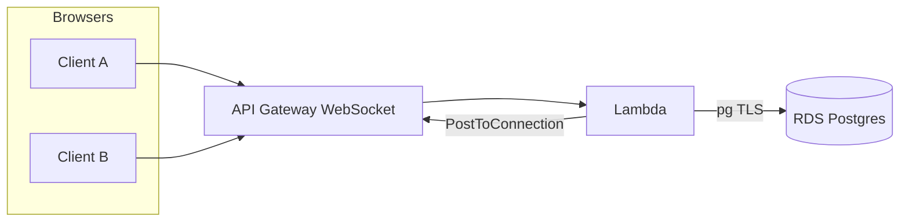

# Anonymous random text chat

Full-stack anonymous pairing chat: **WebSocket** matchmaking on **AWS** (Lambda, API Gateway, RDS PostgreSQL) and a **React + Vite** client deployable on **Vercel**. No accounts; each tab gets a short-lived session id, FIFO-style matching, skip/end with partner notification, disconnect handling, and per-connection rate limits.

---

## 1. What this is

A minimal production-style demo: two strangers are matched into a one-to-one text room. Messages never hit REST; they flow over a single WebSocket through API Gateway to Lambda, which persists state in Postgres and pushes to the peer with `PostToConnection`.

---

## 2. Architecture (high level)

| Layer | Choice | Role |
|--------|--------|------|
| Transport | API Gateway WebSocket | Long-lived connections; routes map to Lambda. |
| Compute | Lambda (Node.js 20) | `$connect` / `$disconnect`, JSON actions (`init`, `search`, `message`, `skip`, `end`). |
| Data | RDS PostgreSQL 16 (`db.t3.micro`) | `connections` (status, partner, session ids), `rate_limits` sliding window. |
| Secrets | Secrets Manager | DB master password (CDK-generated). |

Lambda is **not** in the VPC: RDS is **public** on `5432` with a security group open to `0.0.0.0/0` so this stack works on small accounts without NAT. That is a **demo tradeoff**; production would use private subnets, RDS Proxy or similar, and tighter network rules.



Implementation detail: [`backend/lib/backend-stack.ts`](backend/lib/backend-stack.ts), [`backend/lambda/websocket/handler.ts`](backend/lambda/websocket/handler.ts).

---

## 3. Matchmaking and chat flow

1. Client opens `wss://…/prod`. `$connect` inserts a row: `idle`, new `session_id` (UUID).
2. Client sends `{"action":"init"}` → server responds `{ "type":"session", "sessionId" }`.
3. Client sends `{"action":"search"}`. Inside a transaction: set self to `waiting`; pick oldest other waiter with `ORDER BY updated_at` and `FOR UPDATE SKIP LOCKED`. If matched, both become `in_chat` with the same `chat_id` and receive `{ "type":"matched", … }`. Otherwise `{ "type":"status", "status":"searching" }`.
4. `{"action":"message","text":"…"}`: length cap (2000) and rate limit (30 / 60s per connection); peer gets `{ "type":"message", "fromSessionId", "text" }`.
5. `skip` or `end`: both cleared; partner gets `chat_ended` with `partner_skipped` / you get `you_skipped`.
6. Tab close → `$disconnect`: row removed; ex-partner gets `partner_disconnected`.
7. **Search again while in chat** clears the old chat first; previous partner gets `chat_ended` with `partner_rematching`.

Protocol tables: [`backend/README.md`](backend/README.md).

---

## 4. Tech stack (why these)

- **WebSocket API + Lambda**: fits the assignment (serverless, pay-per-use, no socket servers to run). Cold starts exist; acceptable for a portfolio piece.
- **PostgreSQL**: durable queue + locking primitives (`SKIP LOCKED`) keep matchmaking correct under concurrency without Redis for this scale.
- **`pg` in Lambda**: simple TLS to RDS; pool size capped low per runtime.
- **CDK**: infrastructure as code, repeatable deploys, outputs for the frontend URL.
- **React + Vite**: fast local dev; `VITE_WS_URL` bakes the WebSocket endpoint at build time (standard Vite env model).
- **Vercel (frontend)**: static hosting + env-based builds; no server needed for the UI.

---

## 5. Deployment

**Backend**

```bash
cd backend
npm install
npm run build
npx cdk bootstrap aws://ACCOUNT/REGION
npx cdk deploy
```

Copy stack output **`WebSocketUrl`** (`wss://…/prod`). That URL *is* the backend for this app.

**Frontend**

Set `VITE_WS_URL` to that value (see [`frontend/.env.example`](frontend/.env.example)), then build and deploy on Vercel. Changing the env requires a **rebuild** (Vite inlines at compile time).

Extended IAM / bootstrap notes: [`backend/README.md`](backend/README.md).

---

## 6. Scalability and ops

- Matchmaking is **transactional SQL**; throughput is bounded by RDS connections, Lambda concurrency, and row-level locking. For very high churn you would add a dedicated queue (SQS + workers), connection pooling (RDS Proxy), or move hot paths to ElastiCache.
- **One Lambda** handles all routes; splitting read/write or separating connect from messaging is a future split if metrics justify it.
- **Schema init** runs `CREATE TABLE IF NOT EXISTS` once per new execution environment (`schemaReady` avoids repeat DDL in the same instance).

---

## 7. Known limitations

- **Cold starts** (Lambda) and **RDS** wake-up after idle add latency.
- **Public RDS + open SG** is intentional for Lambda-without-VPC; not a production security posture.
- **Single region**; no cross-region pairing.
- **No persistence** of message history (by design for anonymous chat).

---

## 8. Run locally

**Backend:** synthesize or deploy with CDK (see above). There is no long-running local WebSocket server in this repo; the realistic path is deploy to AWS and point the UI at `WebSocketUrl`.

**Frontend:**

```bash
cd frontend
cp .env.example .env
# Edit .env: set VITE_WS_URL to your deployed wss:// URL
npm install
npm run dev
```

**Repo layout**

```
/backend    AWS CDK app + Lambda source
/frontend   Vite + React client
README.md   This file
```

Deeper CDK and protocol reference: [`backend/README.md`](backend/README.md). Frontend-only notes: [`frontend/README.md`](frontend/README.md).

---

## Deliverables checklist

| Item | Notes |
|------|--------|
| Live frontend | Vercel (or similar) URL |
| Live backend | `WebSocketUrl` from CDK outputs |
| Source | This repository |
