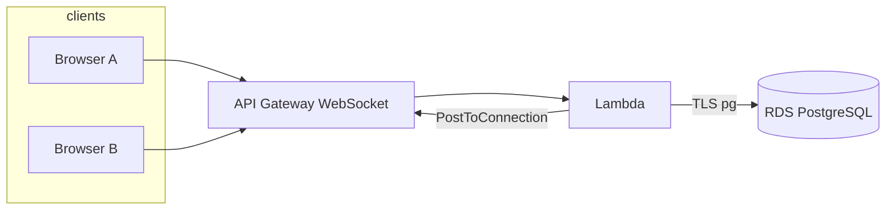

# TapTalent — Anonymous random chat (AWS backend)

Implements the **Backend** portion of *Anonymous Random Text Chat*: anonymous WebSocket clients, temporary session IDs, random pairing (one active chat per user), skip/end with partner notification, disconnect handling, and basic rate/size limits. **SQL** state is in **Amazon RDS for PostgreSQL** (`db.t3.micro`, Free Tier–eligible). Lambda uses the **`pg`** driver and reads the master password from **Secrets Manager**. RDS is **publicly reachable** on `5432` from any IPv4 so Lambda (no fixed egress IP) can connect — **demo only**; use a private VPC + NAT or RDS Proxy for production.

**Why not Aurora Serverless v2 here?** Some AWS accounts on a limited “free plan” cannot create that cluster unless **Express** configuration is enabled; RDS PostgreSQL micro avoids that error.

## Architecture overview

| Piece | Role |
|--------|------|
| **API Gateway (WebSocket)** | Persistent client connections; routes by `$request.body.action` (`search`, `message`, `skip`, `end`, `init`) plus `$default`. |
| **Lambda (Node.js 20)** | `$connect` / `$disconnect` / message routes; matchmaking; `PostToConnection` to the partner. |
| **RDS PostgreSQL 16 (`db.t3.micro`)** | SQL for connections, waiting queue (`FOR UPDATE SKIP LOCKED`), and per-connection rate windows. |
| **Secrets Manager** | Master DB password (CDK-generated). |



## Matchmaking and chat flow

1. **Connect** — Client opens `wss://.../prod`. Lambda inserts a `connections` row (`idle`, new `session_id`).
2. **init** (optional) — Client sends `{"action":"init"}`; server replies `{ type: "session", sessionId }`.
3. **search** — Client sends `{"action":"search"}`. In a **transaction**, Lambda sets this connection to `waiting`, then selects another `waiting` row with `ORDER BY updated_at` and `SKIP LOCKED`. If found, both rows become `in_chat` with the same `chat_id` and each other’s `connection_id` as `partner_id`; both receive `{ type: "matched", ... }`. Otherwise this client gets `{ type: "status", status: "searching" }`.
4. **message** — `{"action":"message","text":"..."}`: validated for length and rate; forwarded to the partner as `{ type: "message", text, fromSessionId }`.
5. **skip / end** — `{"action":"skip"}` or `{"action":"end"}` clears the chat for both; partner gets `{ type: "chat_ended", reason: "partner_skipped" }` (or `you_skipped` for the initiator).
6. **Disconnect** — `$disconnect` removes the row and notifies the ex-partner with `{ type: "partner_disconnected" }`.
7. **Re-search while in chat** — Starting a new **search** ends the current chat first; the old partner receives `{ type: "chat_ended", reason: "partner_rematching" }`.

## WebSocket protocol (client ↔ server)

| Client → server | Server → client (examples) |
|-----------------|----------------------------|
| `{"action":"init"}` | `{ "type":"session","sessionId":"..." }` |
| `{"action":"search"}` | `{ "type":"status","status":"searching" }` or `{ "type":"matched", "chatId","yourSessionId","partnerSessionId" }` |
| `{"action":"message","text":"hello"}` | `{ "type":"message","text","fromSessionId" }` (to partner) |
| `{"action":"skip"}` / `{"action":"end"}` | `{ "type":"chat_ended","reason":"..." }` |

**Limits:** up to **2000** characters per message; **30** messages per **60** seconds per connection (stored in `rate_limits`).

## Deployment approach

### Prerequisites

- Node.js 18+, AWS CLI v2, CDK CLI (`npm install -g aws-cdk`).
- IAM permissions for CDK deploy: CloudFormation, Lambda, API Gateway v2, IAM (pass role), EC2 (VPC), RDS, Secrets Manager, S3 (CDK assets), plus **bootstrap** stack.
- If `cdk synth` fails with `ec2:DescribeAvailabilityZones`, either attach **`AmazonEC2ReadOnlyAccess`** (or equivalent) **or** add AZs to **`cdk.context.json`** (see [CDK context](https://docs.aws.amazon.com/cdk/v2/guide/context.html)). This repo includes a sample `cdk.context.json` entry; adjust **account** and **region** for your environment.

### Commands

```bash
cd backend
npm install
npm run build
npx cdk bootstrap aws://ACCOUNT/REGION   # once per account/region
npx cdk deploy
```

Copy the **`WebSocketUrl`** output (`wss://{api-id}.execute-api.{region}.amazonaws.com/prod`) into your **React (Vercel)** app as the WebSocket endpoint.

**Cost note:** `db.t3.micro` is often covered by **RDS Free Tier** for new accounts (750 hours/month, 12 months — confirm in [RDS Free Tier](https://aws.amazon.com/rds/free/)). Delete the stack when finished:

```bash
npx cdk destroy
```

If a previous deploy failed and CloudFormation shows **`ROLLBACK_COMPLETE`**, delete the **`BackendStack`** stack in the console (or run `npx cdk destroy`), then deploy again.

## Known limitations

- **Cold starts** on Lambda and **RDS** startup after idle can add latency on first messages.
- **Horizontal scaling:** matchmaking is transactional SQL; very high concurrency may require tuning (Postgres connection limits, RDS instance size, or a dedicated queue service).
- **Global `schemaReady` flag** in the Lambda instance avoids re-running DDL; **new** execution environments still run `CREATE TABLE IF NOT EXISTS` once (safe and idempotent).
- **Route selection** uses `$request.body.action`; clients should send JSON with an `action` field (or rely on `$default` treating missing `action` as `message`).

## Local development

- `npm run build` — compile CDK app.
- `npm test` — asserts WebSocket API and RDS DB instance exist in the template.
- `npx cdk synth` — emit CloudFormation without deploying.

## Assignment mapping

| Requirement | Implementation |
|-------------|----------------|
| Anonymous, no login | No auth on WebSocket API. |
| Temporary session ID | UUID per connection in SQL. |
| Random / FIFO matchmaking | Oldest `waiting` peer, `SKIP LOCKED`. |
| One chat per user | Enforced by `status` / `partner_id`. |
| Real-time text | WebSocket + `PostToConnection`. |
| Skip / end / re-match | `skip`/`end`/`search` handlers + notifications. |
| Partner disconnect | `$disconnect` + `partner_disconnected`. |
| Rate / length limits | `rate_limits` table + 2000-char cap. |
| Node.js + WebSockets + SQL | Lambda + API Gateway WebSocket + RDS PostgreSQL (`pg`). |

The **React (Vite) frontend** lives in [`../frontend/`](../frontend/) — see [frontend/README.md](../frontend/README.md). Set **`VITE_WS_URL`** to the deployed **`WebSocketUrl`**. The assignment overview for graders is in the [root README.md](../README.md).
